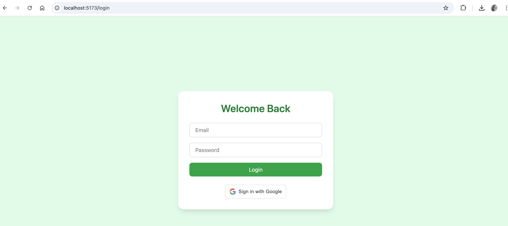

# RIBBIT REELS

RibbitReels is a modular .NET Core REST API designed to deliver short-form educational content in the form of `Branches` (learning paths) and `Leaves` (90-sec video clips). Check out 🟩🟪🟨 [react frontend - WIP 😎](https://github.com/godfreyowidi/Ribbit-Reels-Frontend) which we use to consume the http endpoints from Ribbit Reels backend.

## 🧠 Concept Overview
- **Users** can register and log in via email/password or google
- A **Branch** is a learning path
- A **Leaf** is a 90-sec video
- **Users track progress** through branches
- Support for **branch assignment** by managers/admin (for b2b scenario)

## 🕋 Project Structure
- `RibbitReels.Api:` Entry point for our HTTP requests.

- `RibbitReels.Data:` EF Core context and models.

- `RibbitReels.Services:` Business logic layer.

- `RibbitReels.Unittest:` Unit tests.

- `RibbitReels.IntegrationTests:` Integration tests.

## ⚙️ Setup Instructions
### Local Development
#### Navigate to solution root
_`dotnet build`_
#### Run migrations
_`dotnet ef database update --project RibbitReels.Data --startup-project RibbitReels.Api`_
#### Run API
_`cd RibbitReels.Api`_
_`dotnet run`_

## Docker
#### Build image
_`docker build -t ribbitreels-api .`_
#### Run container
_`docker run -p 5000:80 ribbitreels-api`_

## Github Actions CI/CD
Auto builds, test and deploys.
- On push to main:
    - Docker image built
    - Pushed to Github Container Registry (GCR)
    - Terraform initializes & applies Azure infra changes
    - Container App deployed
- See _.github/workflows/ci.yml for details_

## Terraform + Azure Setup
### Pre-create backend infra:

1. _`az group create --name ribbitreels-rg --location eastus2`_

2. _`az storage account create \`_

    _`--name ribbitreelstfstate \`_

    _`--resource-group ribbitreels-rg \`_

    _`--location eastus2 \`_

    _`--sku Standard_LRS \`_

    _`--encryption-services blob`_

3. _`az storage container create \`_

    _`--name tfstate \`_

    _`--account-name ribbitreelstfstate --auth-mode login`_
### Initialize Terraform
_`cd infra`_

_`terraform init -reconfigure`_

_`terraform plan`_

_`terraform apply`_

## 🧪 Running Tests

In the project root, run both unit and integration tests with:

_`dotnet test`_

Automatically detects and runs tests in both _`RibbitReels.Unittest`_ and _`RibbitReels.IntegrationTests`_.

Results include pass/fail/skip summaries for each test project

### 📬 RibbitReels Postman Collection

Prepared a Postman collection to help you explore the API endpoints.

#### 🚀 How to Use

- Download the Collection [⬇️ Ribbit Reels.postman_collection.json](https://ribbit-reels.postman.co/workspace/Ribbit-Reels~a02db2b0-e162-4920-9cdf-8efb04c6493a/collection/18724757-92af88be-3153-448e-8f1f-616e1f7a3fc9?action=share&source=copy-link&creator=18724757). You can also use the provided collection when you clone the repo

- Import into Postman

- Open Postman

- Click on Import

- Upload the .postman_collection.json file

- Configure Environment (optional)

- Set a variable base_url to the deployed API endpoint:

_`https://ribbitreels-api.livelytree-66e8474d.eastus2.azurecontainerapps.io`_

Or use _`http://localhost:5271`_ for local testing

#### Start Testing!
- Use the collection to test endpoints like:

- POST: /api/auth/register

- POST /api/branch

- GET api/leafs

- POST /api/branches/{branchId}/complete

## 🧰 Key Patterns
#### ✅ OperationResult<T> Wrapper
Used for clear, consistent handling of service outcomes.

example usage:

_`public async Task<OperationResult<Branch>> CreateBranchAsync(Branch branch)`_

**Benefits:**

- Wraps success or failure with HTTP status code.

- Enables chaining and consistent API responses.

- Centralizes exception + error message handling.

#### 🧩 IOptions<T> + IConfiguration
Used for injecting settings like Google Auth

example usage

_`public UserService(IOptions<GoogleAuthConfiguration> options, IConfiguration config) {`_

_`_googleConfig = options.Value;`_

_`_configuration = config;`_

_`}`_

***Benefits:***

- Type-safe access to config.

- Clean separation of concerns.

- Makes unit testing easier by mocking IOptions<T>.

## 🛠 Tech Stack

- .NET 8

- EF Core + SQL Server

- Docker

- Terraform

- Azure Container Apps

- GitHub Actions CI/CD

## 🔜 Features Coming Soon - TODO

- Ad placements

- Paid Branches

- User content ratings & feedback

### Important commands
dotnet ef migrations add InitialCreate --project ../RibbitReels.Data --startup-project .

dotnet ef database update --project ../RibbitReels.Data --startup-project .

dotnet test --logger "console;verbosity=detailed"

dotnet test ./RibbitReels.IntegrationTests/RibbitReels.IntegrationTests.csproj

sqlcmd -S localhost,1433 -U sa -P 'Password123!' -d RibbitReelsDb

## License

